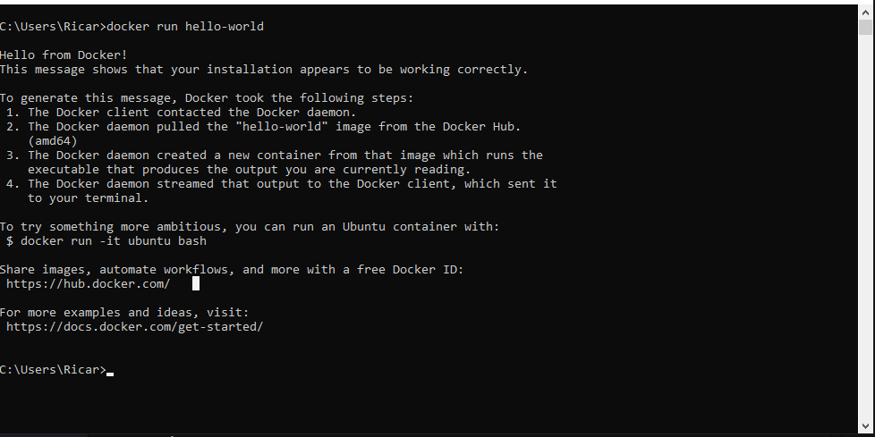
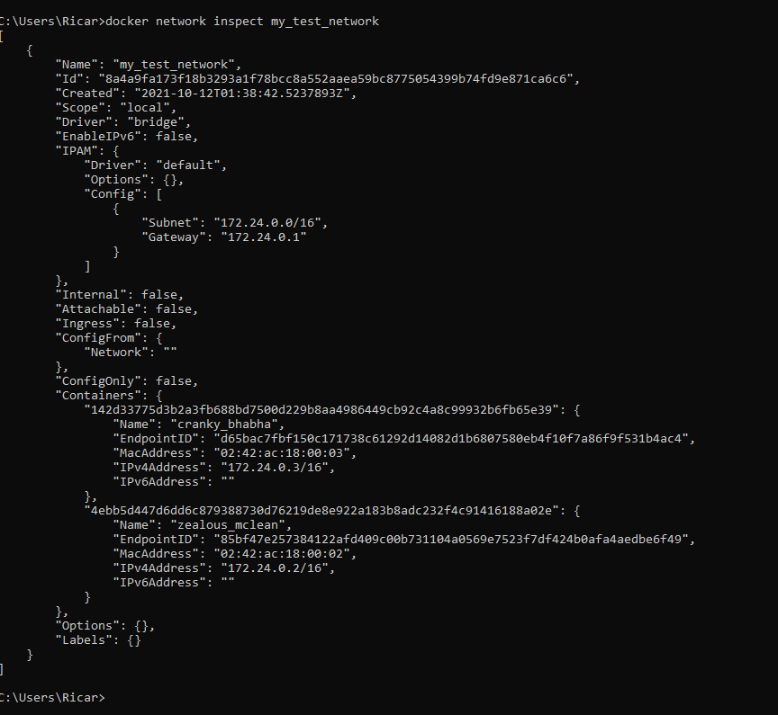
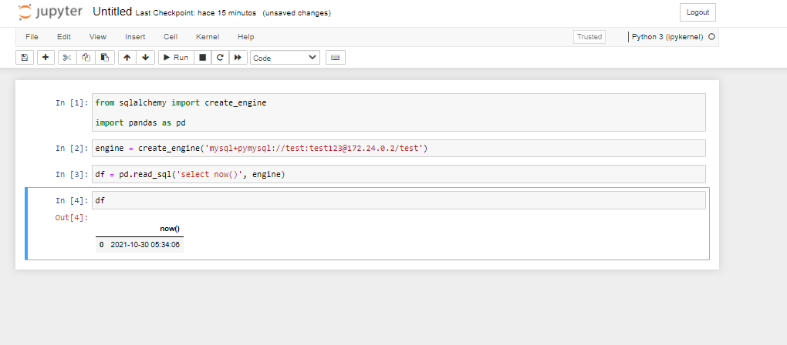
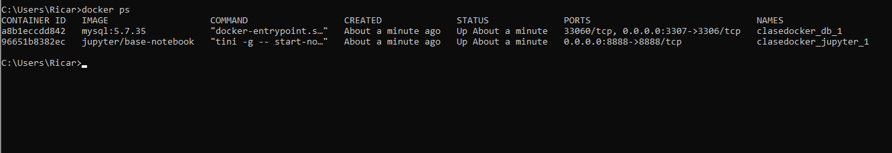
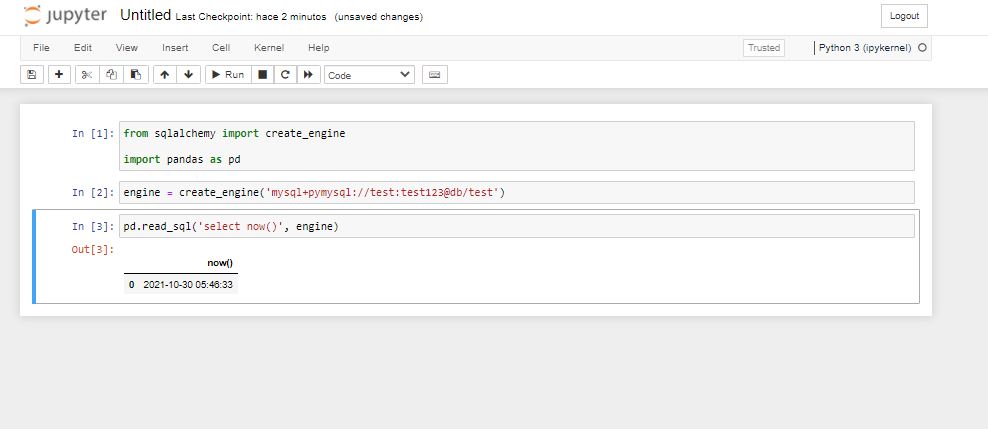

# Clase de Docker


## Instalacion Docker

La instalacion de Docker comienza por descargar el software de la siguiente pagina [Sitio Docker](https://docs.docker.com/get-docker/)

Es necesario tomar en cuenta los requisitos de cada sistema operativo para una correcta instalacion del software.

### Requerimientos

En mi caso instale docker en Windows 10 Pro, los requisitos para windows son los siguientes [Requisitos](https://docs.docker.com/desktop/windows/install/#system-requirements)

* Windows 11 Pro de 64 bits
* Windows 10 Pro de 64 bits
* Habilitar las caracteristicas de HSL2 en Windows
* Requisitos de hardware
    * Procesador de 64 bits
    * Al menos 4 GB de RAM
    * El soporte de virtualizacion debe de ser activado en la BIOS

## Hello Word

Para nuestro primer acercamiento con docker ejecutamos el comando
```docker run hello-world```

Con este comando nos aseguramos que la instalacion de docker se realizo correctamente. La salida del comando debera lucir como la siguiente imagen.



## Comandos

A continuacion describire algunos de los comandos vistos en clases, los cuales son los mas comunes y utilizados en cualquier proyecto donde el uso de Docker se encuentre.

### Descargar contenedores

El siguiente comando descargara la imagen deseada de Docker Hub, el repositorio oficial de imagenes de contenedores.
El tag es importante pues nos ayudar a indicar que version exactamente de la imagen queremos obtener, si no se indica el tag el valor por default es latest.

```docker pull <nombre_imagen:tag>```

### Crear una red

Con el siguiente comando creamos una red de tipo Bridge, con el nombre deseado.

```docker network create -d bridge <nombre_red>```

### Inspeccionar una red

Con el siguiente comando podemos inspeccionar aquellos contenedores que estan en nuestra red.

```docker network inspect <nombre_red>```

### Correr un contenedor

Para levantar un contenerdor debemos ejecutar el siguiente comando.

```docker run <nombre_imagen>```

EL comando de ejecutar un contenedor posee muchas otras opciones para la forma en la que el contenedor se ejecutara, algunas vistas en clae son:
* Ejecutar el contenedor en una red especifica
    ```docker run --network <nombre_red> <nombre_imagen>```
* Indicar al contenedor que puertos exponer y con que puertos locales comunicarse. (El puerto del lado izquierdo es de la computadora loca, y el del lado derecho el puerto del contenedor)
    ```docker run <nombre_imagen> -p <puerto_local>:<puerto_contenedor>```
* Pasar variables de entorno al contenedor
    ```docker run -e "<NOMBRE_VARIABLE=VALOR_VARIABLE>"```

#### Ejemplo

Para ejemplificar la ejecucion durante la clase levantamos una imagen de mysql, indicando que esta correria en una red con el driver tipo bridge y le pasamos la configuracion de la base de datos por medio de variables de entorno.
Adicionalmente levantamos en otra terminal una imagen de jupyter notebook para conectarnos por medio de python a la base de datos.

**Comando para levantar la imagen de mysql version 5.7.35**

```docker run -it --network my_test_network -e "MYSQL_ROOT_PASSWORD=root123" -e "MYSQL_DATABASE=test" -e "MYSQL_USER=test" -e "MYSQL_PASSWORD=test123" mysql:5.7.35```

**Comando para levantar la imagen de jupyter notebook**

```docker run --network my_test_network -p 8888:8888 jupyter/base-notebook```

Ahora que estan corriendo nuestras contenedores podemos inspeccionar la red con el comando mencinoado en la seccion anterior pero con nuestro nombre de red.

```docker network inspect my_test_network```

El resultado de dicho comando deberia mostrarnos los contenedores, ambos con IP's asignadas. La siguiente imagen muestra el resultado en mi caso.



Ahora se muestra como se comprobo el funcionamiento de ambos contenedores dentro de la misma red. Un query sencillo se ejecuta desde python utilizando un notebook con conexion hacia la base de datos en el contenedor de mysql.



## Docker Compose

Docker compose es una herramienta que nos permite ejecutar una aplicacion o una infraestructura en donde se encuentren multiples contenedores.
En DOcker compose utilizamos la sintaxis YAML para definir la configuracion de los servicios de nuestra aplicacion con multples contenedores.

A continuacion el docker compose utilizado para levantar los contenedores del ejemplo anterior pero configuradores con con la sintaxis YAML. Dicha configuracion debe ser guardado en un archivo al cual llamaremos docker-compose.yml

```
version: '3.7'

services:
  db:
    image: mysql:5.7.35
    volumes:
      - db_data:/var/lib/mysql
    restart: always
    ports: 
      - 3307:3306
    environment:
      MYSQL_ROOT_PASSWORD: root123 
      MYSQL_DATABASE: test 
      MYSQL_USER: test 
      MYSQL_PASSWORD: test123 

  jupyter:
    image: jupyter/base-notebook
    ports:
      - 8888:8888

```

### Ejecucion del Docker Compose

```docker-compose up```

El resultado del comando no deberia presentar ningun log de color rojo.

Podemos chequear con el comando que los servicios de nuestro docker compose esten levantados correctamente.
```docker ps```



Realizamos nuevamente nuestra consulta desde jupyter notebook a nuestra base de datos y el resultado se ve asi



**Nota**: Notar que en la configuracion de la conexion desde el jupyter noteboook a la base de datos algo cambio, la IP de la base de datos en este caso no fue necesaria, asi como tambien en el docker compose no se especifico una network.
Lo que pasa en docker compose es que Docker se encarga de la funcionalidad de DNS, en donde al poner el nombre del servicio en la direccion de la base de datos, Docker compose por detras hace la traduccion como un servidor DNS a la direccion asignada a dicho servicio.

### Escalamiento de los servicios de Docker Compose

Con docker compose podemos definir la cantidad de instancias que se requieren levantar en cada servicio, simulando asi una infraestructura de un servicio real donde se tiene un balanceador de carga para multiples instancias del mismo servicio.

A continuacion se muestra el comando para escalar un servicio en especifico del docker compose.

```docker-compose scale db=2 jupyter=2```

Que problema encontraremos aqui? bueno pues que multiples instancias del mismo contenedor querran utilizar el mismo puerto, para resolver esto es necesario colocar un servicio de load balancer para que el sea el indicado para asignar los puertos y asi mismo mantener el orden de que servicios estan en pia para redireccionar el trafico. Dicha implementacion se hara posteriormente en clase utilizando una imagen de NGinx como load balancer.
